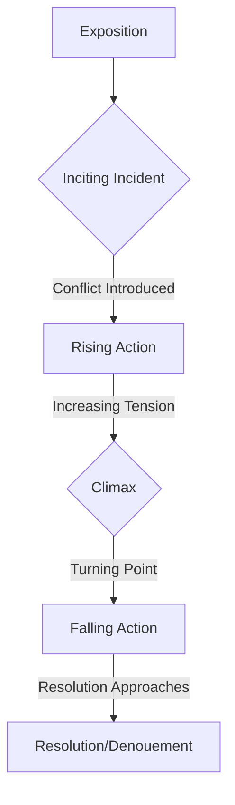
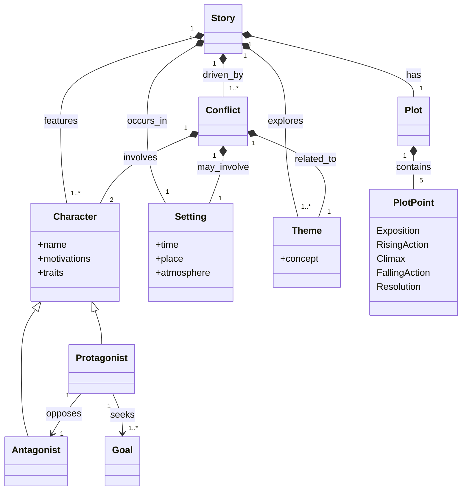
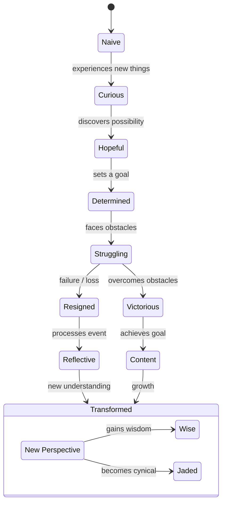

# Story Concepts Diagrams

This document illustrates core story concepts using Mermaid.js diagrams.

## 1. Narrative Arc (Activity Diagram)

This diagram visualizes the typical progression of a story, often referred to as Freytag's Pyramid.

## 2. Story Elements (Class Diagram)

This diagram shows the relationships between fundamental components of a story.

## 3. Character Emotional Journey (State Machine Diagram)

This diagram illustrates a possible emotional progression for a character throughout a story.

